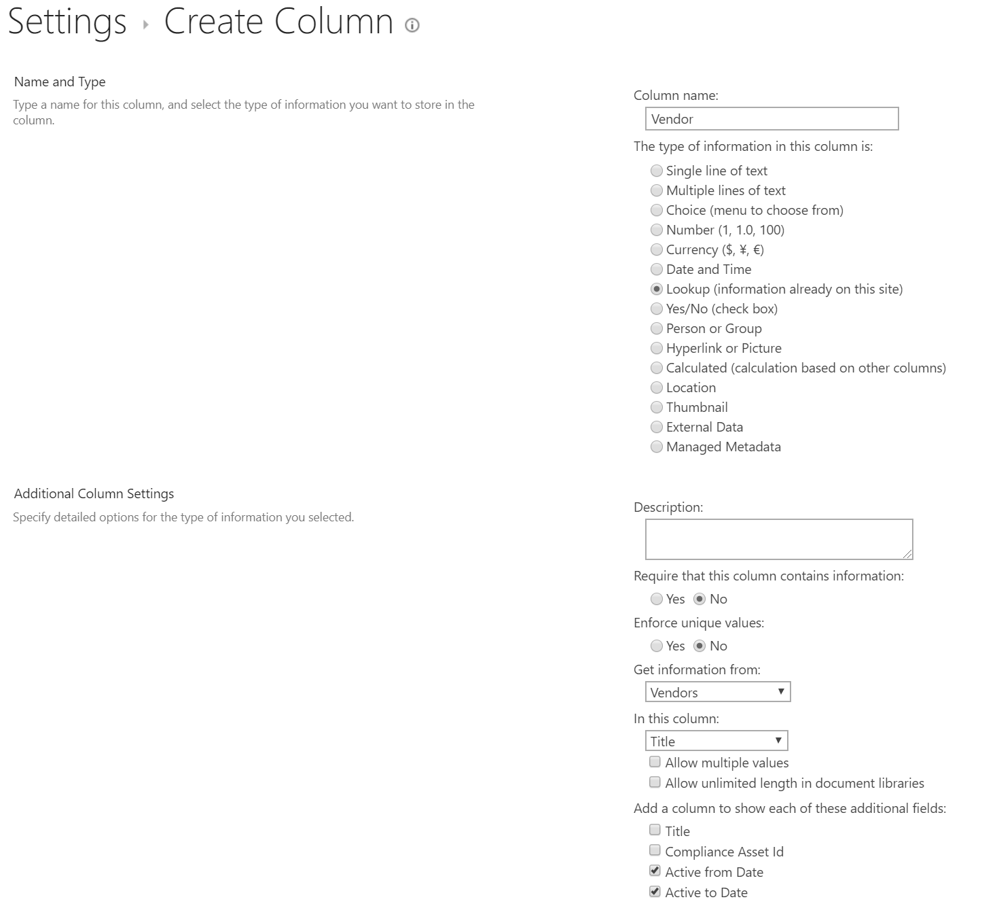
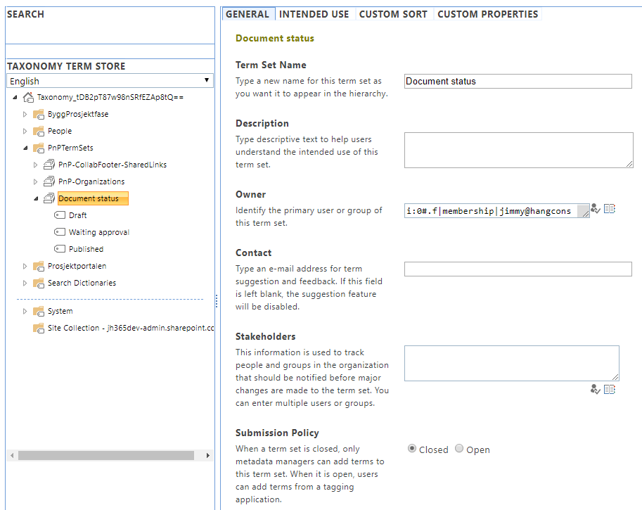
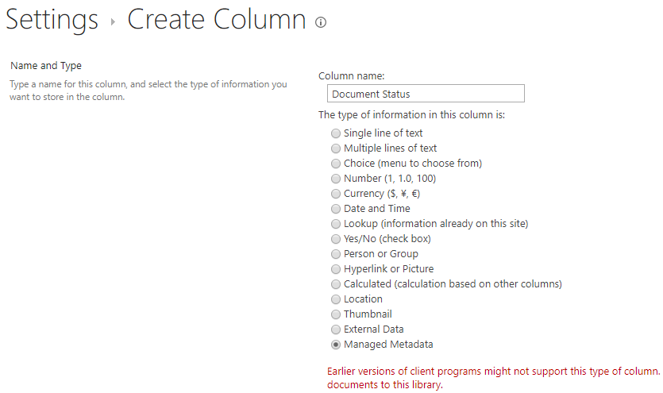
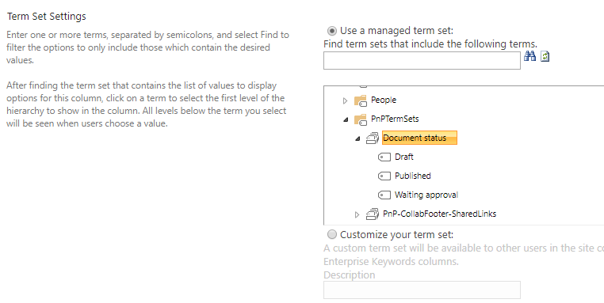
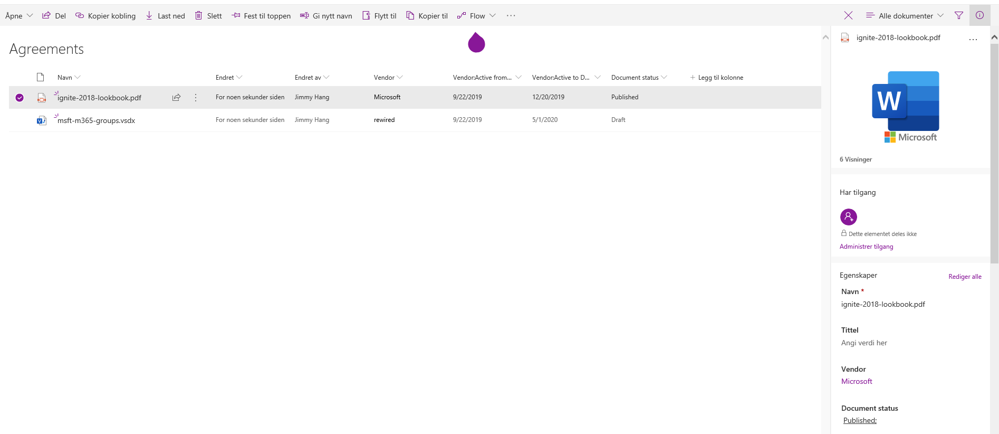

# Information Architecture - Managed Metadata versus Lookup columns

[!INCLUDE [content-disclaimer](includes/content-disclaimer.md)]

Before we jump to the topic at hand, a little recap of the terminology involved:

* Metadata: means information about something, in SharePoint usually information about documents, pages or list items
* List column: is a metadata column in a list or library. The column itself can be of different data types: text, numbers, date & time, people picker, managed metadata, etc.
* Lookup column: This is a column type where the data values come from another list in the same site (web).
* Managed metadata: A globally available metadata service that can be shared by all site collections in SharePoint Online or SharePoint on premises.

## How do Lookup columns work?

A lookup column is a metadata column that gets its data from another list in the same site. Before you start creating the column it's always a good practice to actually think of how your column relationships will work. This will depend on your use case(s).

Example: I have a document library where our company stores our vendor agreements and would like to "tag" each agreement with the vendor name(s). That way it's easier for us to find specific documents, filter by vendor, etc.

* In SharePoint, create a document library called Vendor Agreements
* In the same site create a custom list named Vendors
* You can extend the list to contain more data, but in this case I will create two extra date & time columns to see if the vendor is still active or not. You can of course use column formatting to make it look better.

* Navigate back to the Vendor Agreements document library
* In the Vendor Agreements library, create a new column and choose lookup for the data type. Choose the Vendor list and the Title column, and include any extra data you might need from the vendor list. Note: not all data types are supported.
* After the lookup column is added you can use it to tag any document you have in the library

## Pros of Lookup columns

* You can create lookup columns as site owner
* You can add more fields from the source list as metadata to the destination list
* Members can contribute to the source list, without changing the list setup
* All updates to the source list will update the destination list

## Cons of Lookup columns

* Lookup columns can only be created with source lists in the current site
* In order to re-use in another site we have to recreate both the source list and the lookup column
* Beware that deleting items from the source list will remove those values from items in the destination list, unless you remember to use "Enforce relationship behavior, restrict deleting" when creating the column.

## How do Managed Metadata columns work?

Managed Metadata columns depend on the SharePoint Taxonomy service for syndication. Because it's a globally available feature you need to have delegated ownership to at least a term set in order to be able to manage it.

* In this example I've created a term set called **Document status** with the terms **Draft**, **Waiting approval**, or **Published**
* I'm adding this term set as a column to the Vendor Agreement library above
* I'm using this column to track the approval of the documents we have in the library

## Pros of Managed Metadata columns

* Managed Metadata is globally available - across all sites in the farm or tenant
* Managed Metadata supports language translations
* Changes to the term set values will be updated across all sites
* Administrators can control who can contribute to each term set
* Combined with search, you can create a global search center with refiners across all sites using the term set

## Cons of Managed Metadata columns

* Cannot be managed freely by site owners, changes have to be added to a change policy to avoid failures
* Managed metadata is "singular" meaning you cannot connect other metadata to it, like we can with lookup columns. For example, the **Active from Date** and **Active to Date** in the first example above.

## My experience

* There is no single way of doing things in SharePoint. It all depends on the use cases.
* I normally use Managed Metadata when dealing with cross site publishing or global search-related metadata. Because the metadata values are normally managed by a few people and used widely across all sites in SharePoint, we get more consistency and converge on a common understanding. This is especially true when building Document Management solutions or Intranet News publishing.
* I use Lookup columns, when I'm building solutions that are locally related to a site, and the lookup data is from multiple lists already in the site. For example, when building custom apps with Power Apps and I'm using SharePoint lists as data sources.  

---

**Principal author**: [Jimmy Hang, MCT, MCSE: Productivity](https://www.linkedin.com/in/jimmyhang/)
