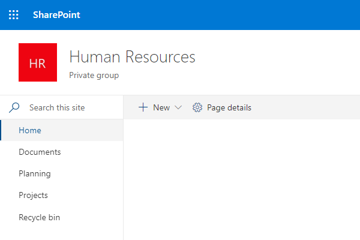
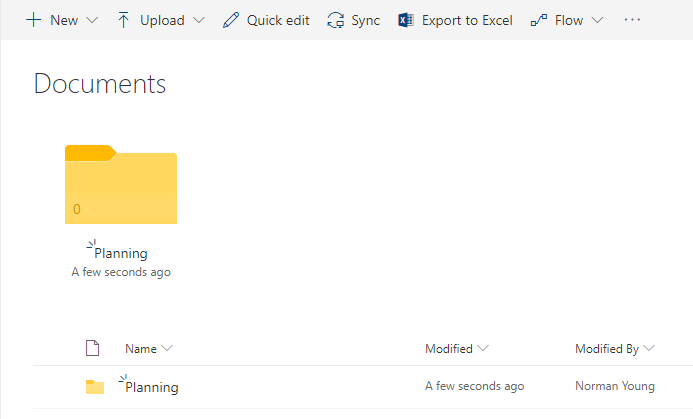
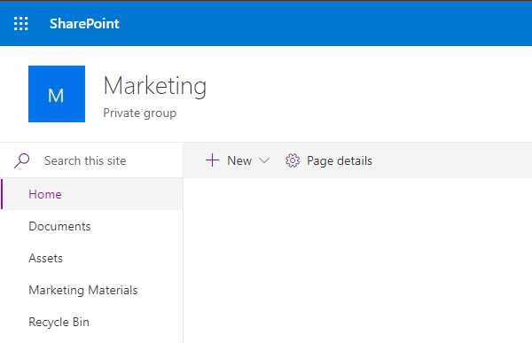
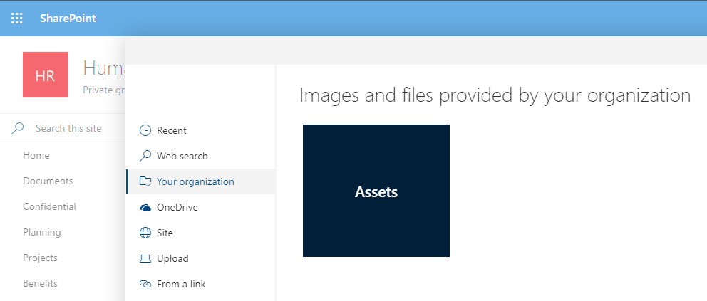

# Library scenarios

[!INCLUDE [content-disclaimer](includes/content-disclaimer.md)]

This guide will provide scenario-based guidance for the planning of SharePoint document libraries.

## Functional group scenario

It is not uncommon to have functional groups within teams. For example, *Benefits* or *Pay and Compensation* groups within a *Human Resources* team. Providing dedicated document libraries for each functional group will simplify content organization and user navigation within the site. Files common to all groups would be stored in a common document library.

Using the example of a *Benefits* and *Pay and Compensation* groups within a *Human Resources* team, we would plan for the following document libraries:

- "Documents" used to store files common to all members of the *Human Resources* team.
- "Benefits" used to store files for the *Benefits* functional group.
- "Pay and Compensation" used to store files for the *Pay and Compensation* functional group.

Example image shown below:

## Subject matter scenario

High value or frequently accessed content is often grouped together by subject matter. For example, project plans and governance documents. Creating dedicated document libraries by subject matter can help to organize files and simplify user navigation within the site.

Using the example of *project plans* and *governance documents*, we would plan for the following document libraries:

- "Projects" used to store all project plans and related files.
- "Planning" used to store all governance documents.

Example image shown below:

In some cases, high value content is limited in quantity, and additional document libraries add complexity to user navigation. In these situations, highlight the high value content by [pinning it to the top of the document library](https://support.office.com/article/Highlight-a-file-folder-or-link-in-a-document-library-9c5f46de-f0f4-4cf1-bd5e-b4ebc7a8b31c). When you pin an item, a thumbnail image will appear at the top of the document library page making it easier for users to find it.

Example image shown below:

## Sensitivity scenario

Some sites are required to store sensitive content that is not suitable for site members or visitors to view. For example, confidential *employee reports*. Creating a dedicated document library with unique permissions allow the secured storage of sensitive content within the site while employing a security trimmed navigation experience.

Using the example of *employee reports*, we would plan for a "Confidential" security group and a "Confidential" documentary library with [unique permissions](https://support.office.com/article/Customize-permissions-for-a-SharePoint-list-or-library-02d770f3-59eb-4910-a608-5f84cc297782) that exclude the members and visitor security groups.

Example image below of the "Confidential" security group:

Example image below of the "Confidential" document library unique permissions:

>Custom security groups and document libraries with unique permissions add complexity to ongoing site management. Before implementing consider moving sensitive content to its own site collection.

## Multimedia scenario

Organizations often group image, audio, and video files in document libraries for reference use or archival purposes. For example, *branding* and *marketing materials*. Providing dedicated document library or [Asset Library](https://support.office.com/article/Set-up-an-Asset-Library-to-store-image-audio-or-video-files-96532BF6-DC72-4F82-BF0A-21EF945C4D04) for multimedia purposes allows for consistent use and storage of an organizations image, audio, and video files.

>If you don't see Asset Library as an option in your built-in apps, contact your SharePoint admin to see if they are available for your site.

Using the example of *branding* and *marketing materials*, we would plan for:

- "Assets" document library or Asset Library for image, audio, and video files.
- "Marketing Materials" document library for style guidelines and related content.

Example image shown below:

Multimedia document libraries can be designated as an [Organization Asset Library](/sharepoint/organization-assets-library) making image files available to users for site and page creation.

Example image shown below:

>Video files intended for streaming use should be hosted in [Microsoft Stream](/stream/overview).

---

Principal author: [Norm Young](https://www.linkedin.com/in/norm-young/)
