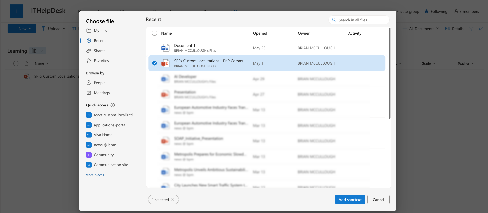
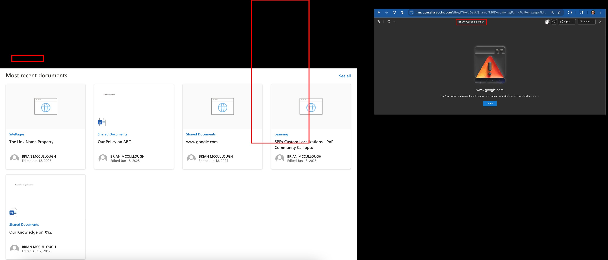
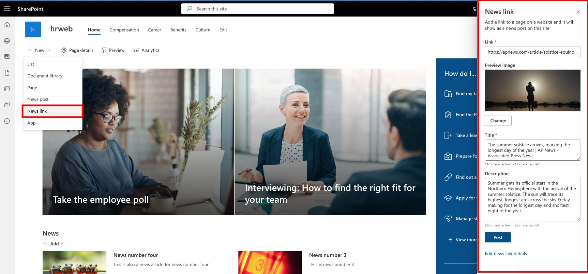
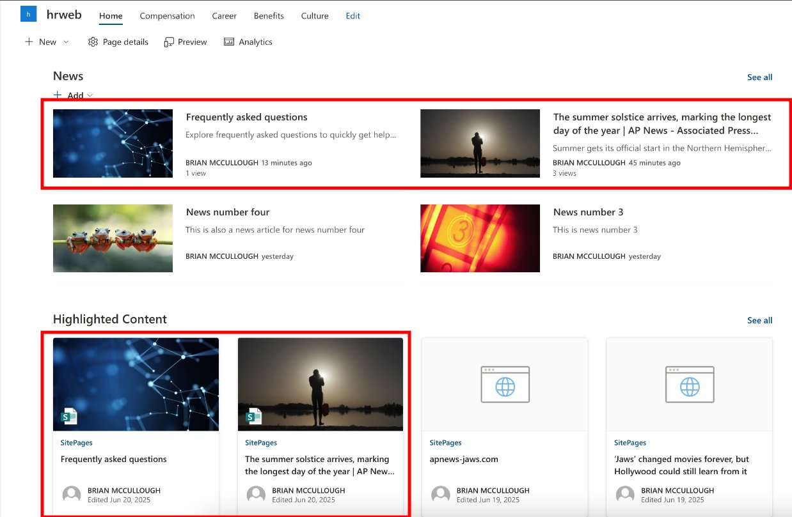
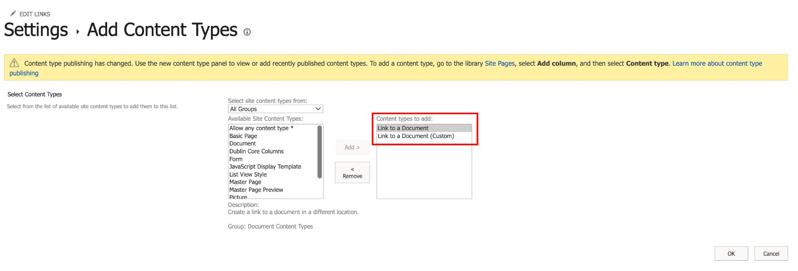
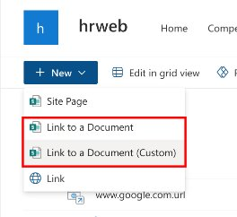
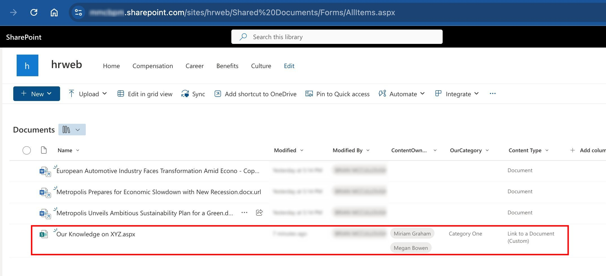
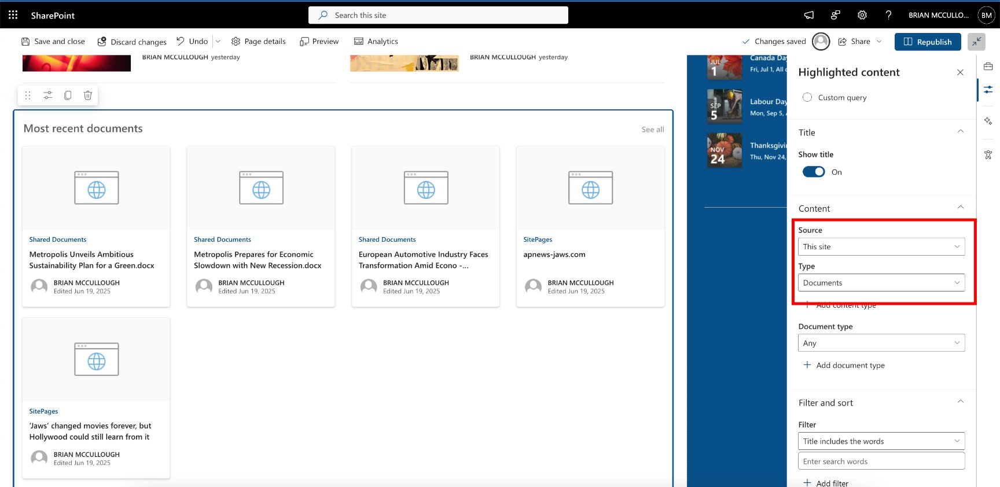

# Link vs News Link vs Link to a Document

[!INCLUDE [content-disclaimer](includes/content-disclaimer.md)]

SharePoint Online provides several ways to link to web-hosted content. You can use hyperlinks in Text web parts, Quick Links, Hero, Call to Action, and more. In lists and libraries, Hyperlink columns are available. For automatic redirection, SharePoint offers three primary features: **Link**, **News Link**, and **Link to a Document**.

While these features are similar, each has unique characteristics and behaviors. This article outlines their differences to help you select the best option for your scenario. All capabilities discussed are based on out-of-the-box SharePoint Online functionality; additional scenarios may be possible with custom code or automation.

## Link

After creating a SharePoint Online site (Team or Communication), you can add a **Link** in any document library, including default libraries like "Site Pages" and "Documents." This feature is also available in any new library you create.

When adding a Link, you enter the URL of the target page or document. You can link to internal or external content and optionally use a picker to select files from your tenant.  
For more information about using the Link functionality, please see: [Add a link in a document library](https://support.microsoft.com/en-us/office/add-a-link-in-a-document-library-346b1eb9-1e71-4155-80ca-f868d058a56a)




Creating a Link generates a `.url` file which is a shortcut that opens the specified URL. The link is embedded in the file, not stored as metadata.  It is stored in a portable format that opens the link in SharePoint and also on desktop operating systems such as Windows and Mac OS if downloaded.  The format of the file is:

```
[InternetShortcut]
URL=https://www.example.com
```

The Link is assigned the library’s default content type (e.g., "Document" or "Site Page"). You cannot customize the New Form for a Link; metadata can be edited after creation using the edit form or properties panel.


### Link in Highlighted Content Web Part

Links display a generic browser icon and use the file name as the card title. For better usability, rename Link files to meaningful names. Author and date reflect the Link file, not the original content.  
Note: Clicking a Link in Highlighted Content opens a view item page, but displays as a warning and requires extra user interaction to navigate to the Link.



### Link in Search Results

Links appear with a browser icon and the `.url` filename. As with the Highlighted Content Web Part, clicking a Link from a search result opens a view form; displaying a warning and users must click "Open" to proceed.


### Link in the News Web Part

Link files cannot be published as news and do not appear in the News web part.

## News Link

**News Link** allows you to link to any web page and publish it as news in SharePoint Online (Promoted State = 2). This is ideal for sharing external or internal news articles.

News Links are created from the site home page or News web part, not from the Site Pages library.



When creating a News Link, SharePoint attempts to populate the preview image, title, and description from the target page’s metadata. These fields can be edited as needed.  
See: [Create and share news on your SharePoint sites](https://support.microsoft.com/en-us/office/create-and-share-news-on-your-sharepoint-sites-495f8f1a-3bef-4045-b33a-55e5abe7aed7#bkmk_newslink)

A News Link creates an `.aspx` file with the "Repost Page" content type, which inherits from "Site Page." These work seamlessly with News and Highlighted Content web parts and redirect users directly to the target page.




News Links are intended for news scenarios. While the Promoted State can be changed via code or automation, there is no out-of-the-box method to treat a News Link as non-news content.

## Link to a Document

**Link to a Document** is a classic SharePoint feature. To use it, add the "Link to a Document" content type to your library.



Create a Link to a Document from the New menu. Enter the name and URL (internal or external). If your content type includes additional metadata, it can be edited after creation.




This feature creates an `.aspx` file, which acts as a SharePoint-only redirect. These files cannot be used as shortcuts outside SharePoint.  The `.aspx` files can be awkward to see in a document library since you typically only see them in Site Pages libraries.



By default, Link to a Document items may not appear in Highlighted Content web parts unless you adjust the source or filter settings.



In search results, Link to a Document displays the specified name and redirects directly to the target without seeing an interim view item page.


## Summary

| Feature                        | **Link**                | **News Link**                | **Link to a Document**         |
|---------------------------------|-------------------------|------------------------------|--------------------------------|
| **File Type**                   | `.url`                  | `.aspx`                      | `.aspx`                        |
| **Where to Create**             | Any document library    | Site home/News web part      | Library with content type      |
| **Redirects To**                | Target URL              | Target URL                   | Target URL                     |
| **Appears in News Web Part**    | No                      | Yes                          | No                             |
| **Appears in Highlighted Content** | Yes (with limitations) | Yes                          | Yes (with configuration)       |
| **Appears in Search**           | Yes                     | Yes                          | Yes                            |
| **Usable Outside SharePoint**   | Yes                     | No                           | No                             |
| **Custom Metadata Support**     | After creation          | Yes                          | Yes                            |

- **Link**: Best for simple shortcuts in libraries, portable outside SharePoint.
- **News Link**: Best for sharing news articles (internal/external) in News web parts.
- **Link to a Document**: Best for classic scenarios needing custom metadata and SharePoint-only redirects.


---

**Principal author:** [Brian P. McCullough](https://www.linkedin.com/in/brianpmccullough/)

---