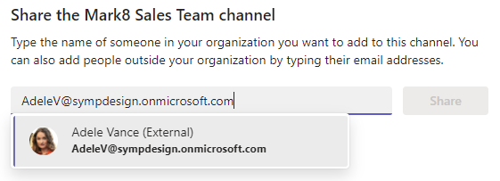
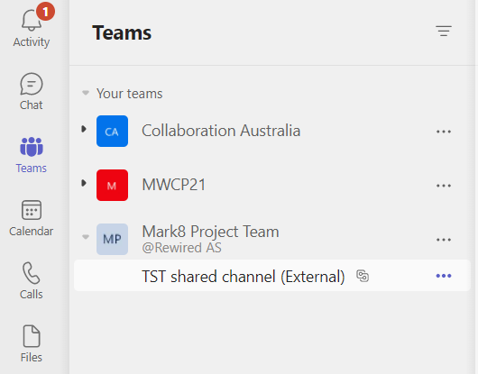
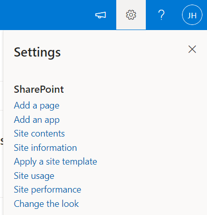
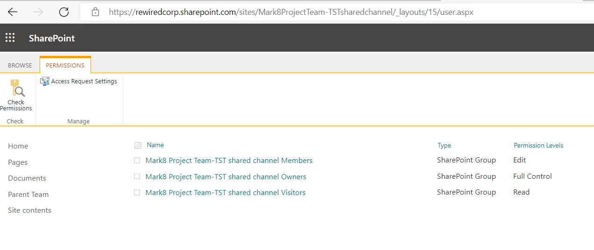

# Teams shared channel for Admins

[!INCLUDE [content-disclaimer](includes/content-disclaimer.md)]

Teams "shared channel" is one of the greatest, if not THE Greatest new feature released to Teams in 2022.

To enable and understand more about this feature follow one of the following guides from:

* [Andrés Gorzelany - Enabling Teams Shared Channels 101](https://get-itips.capazero.net/posts/shared-channels-101)
* [Shared channels in Microsoft Teams (Preview)](https://docs.microsoft.com/en-us/microsoftteams/shared-channels)
* [B2B direct connect overview (Preview)](https://docs.microsoft.com/en-us/azure/active-directory/external-identities/b2b-direct-connect-overview)

After you have enabled shared channel and created your first shared channel, there is a couple of things nice to know.

> [!NOTE]
> Beware that as this feature is in "Preview" the information below might change.

## 1. Difference between external "Guest" and "External"

When you add a external user to your Team, you will se that the user is labeled as a "Guest", this is what most of us are doing right now.

But when you add the same user to a shared channel, that external user will be labeled with "External", meaning there won't be a "conflict" related to the user for this channel.   

After the External user is added, in their Teams client, they will receive a notification and the External team will show up, this worked almost instant, so awesome.

This is also super sweet, as the users don't need to switch tenant.

Collaborating in chats will be "alerted" with a message about the "shared channel", this is great.

## 2. But where is the "External" user?

As you may know, when you add a external user to your Teams they exists as "Guest", and the guest record will exist in your Azure AD, meaning you can enforce policies as MFA for the guest account.

But for shared channels, the "External" user will only exist as an external user to that shared channel, currently I don't see a way in the Admin GUI to see how many "External users" we have or where they are given access to. Meaning as admins we really don't know, even thought we do have the audit logs in Azure AD.

And in SharePoint, in the "Site settings" menu, you won't have a link option for "Site permissions".

But it doesn't mean that its not there, navigating to your shared channel site with the extra url **"/_layouts/15/user.aspx"** will bring you to the classic permission page, I love this page.

With this you will see the your External users with their "ObjectId" and "HomeTenantId".

## Tips and tricks before enabling shared channel for production:

1. Review your user training, and make sure everyone knows the difference between "Guest" and "External".
2. Beware that currently the External user can't be managed outside the Teams shared channel settings, as far as I know.
3. I presume/hope MS will give us a GUI for external users before GA, if not we can create a PowerShell script to get this information from SharePoint Online, from a governance perspective.
4. If you plan to use Shared Channel, make sure you update your governance policies.

---

**Principal author**: [Jimmy Hang, MCT, MCSE: Productivity](https://www.linkedin.com/in/jimmyhang/)

---
