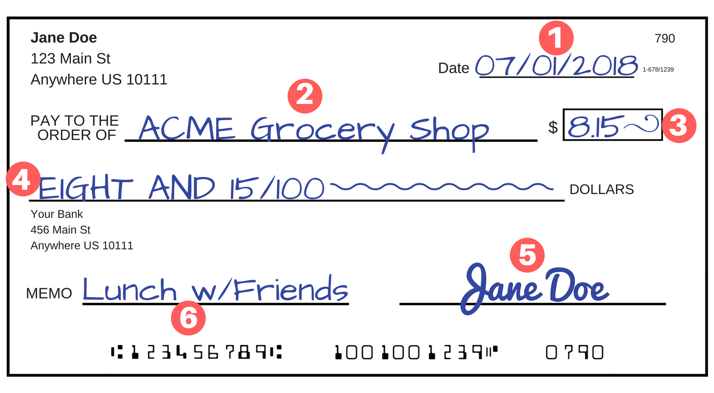

# What is a Site Column?

## Basic Idea

A Site Column is a template of a configured column.  By creating a Site Column, you can reuse it anywhere else in the site and not have to manually rebuild its configuration at each reuse.  

When creating a new column you have a choice to either "Create column" or "Add from existing site columns".  Selecting the latter will add a replica of the Site Column to the location you are working.  Once added, you can edit it in any manner, including changing the name.  

You can return to a site column's configuration at any time and make changes.  Once a column has been created it does not retain any connection to the master site column it was created from.  Changes made to the "Template" do not apply to columns that are based on it.

## Real World Example

When we look at common pieces of paper around the home, we see things with common fields on them all the time. We have signature fields on checks, contracts, repair estimates, etc. We have expiration dates on insurance policies, cans of food, and sweepstakes forms.

On the check below, we can see six individual fields which we use all the time: check date, pay to the order of, amount, written amount, signature, and memo. (For those of you outside the USA, you may not see checks very often - if at all!)

Those common fields are something we rarely think about, but they make sense to us by virtue of their commonality.

## Back to Work

In the workplace, we have similar common fields. If we work at a financial institution, the fields in the check above may be important to us. If we work in a different industry or on different topics, then we will have our own set of common columns.

For example, if we work with Contracts, we may want reusable columns for *Start Date*, *Contracted Party*, *Contract Topic*, *Expiration Date*, etc. Where there is an existing, out of the box Site Column - as with Start Date - we can choose to use it. In other cases, we may decide we need to create our own Site Column to represent the field we need.

## Extra Detail

Site Columns each have a field type (like *Single line of text*, *Multiple lines of text*, *Choice (menu to choose from)*, *Currency ($, ¥, &euro;)*, *Date and Time*, etc.) Each Site Column also has the settings we can use whenever we add a column to a list or library directly, such as whether the Date/Time column should be *Date only* or *Date & Time* or whether the column should be required.

When we create a Site Column and choose the settings we want, we get a column which we can add to multiple lists and libraries in the same site. If we want our columns to be consistent across several sites, we can create them in the Content Type Hub or with Site Designs. The latter is preferable these days, as the Content Type Hub was built in the days when we tended to have larger Site Collections, with many subsites.

## Summary

Site Columns are a way to instantiate common fields across our organization as part of an effective information architecture. We can use Site Columns in lists and libraries to provide consistency. By bundling different combinations of Site Columns together, we can build [Content Types](what-is-content-type.md) which provide reusable structures with benefits in display and search.

---

Principal author: [Marc D Anderson, MVP](https://www.linkedin.com/in/marcanderson)