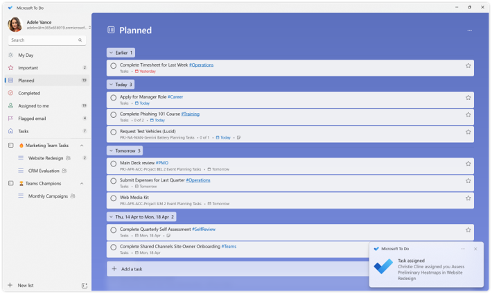
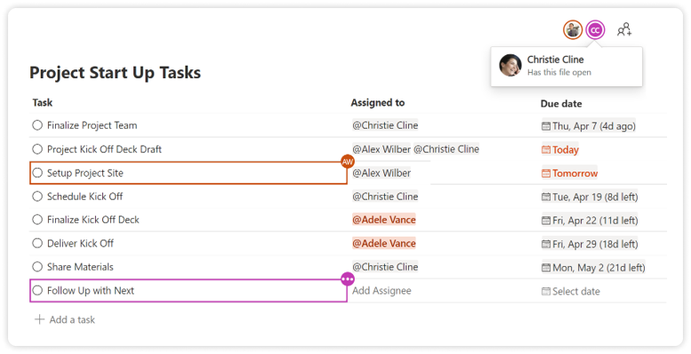
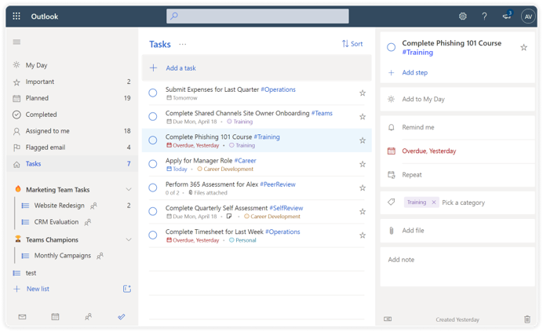
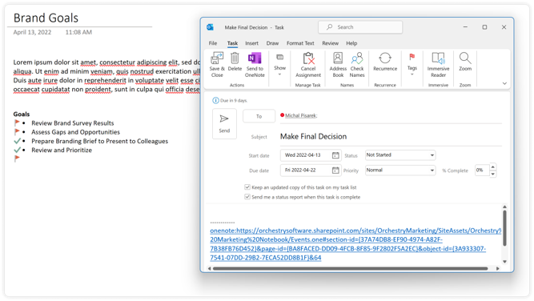
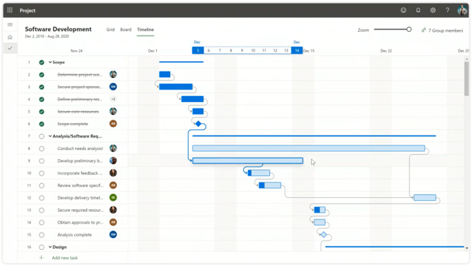
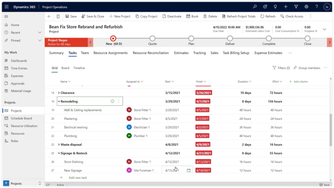
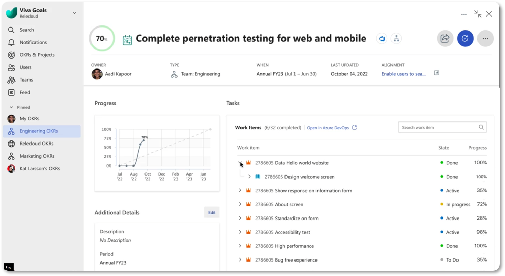

# Which Task Management Tool is Right For Me

[!INCLUDE [content-disclaimer](includes/content-disclaimer.md)]

There are a number of ways to manage tasks in Microsoft 365, some of which overlap, while others don’t. Where are all the places we can create tasks?

## Why are there so many options?

Microsoft has offered a variety of tools to address different use cases for task management, from personal to enterprise. They have also created a number of overlapping user experiences without providing clarity around which tools communicate with one another, and which do not. This creates a huge amount of confusion for end users, in knowing what tool to use when and finding a way to see a holistic view of all their tasks.

The reality is there is no single **“best way”** to manage tasks, and we are still seeing more options being added (e.g., Loop), without a real coherent strategy to tie these options together.

## Microsoft Planner

### Pros - Planner

- The Kanban “task board” is a tried and tested approach that many recognize and Planner has implemented it well
- Planner Tasks integrate well with our views in To Do, Teams, and Outlook
- Support for buckets, progress, labels, assignees, dates, priority, sub-tasks, attachments, comments
- Multiple ways to view information (by plan, by bucket, by progress)
- Tasks can be assigned to multiple people
- Useful filtering to find what you need
- Tasks can be copied or moved to other plans
- Respects underlying group membership
- Support for checklist within a task

### Cons - Planner

- Has seen some minor updates but nothing significant in quite some time
- No consolidation across planner plans
- Little to no extensibility or customization beyond out of the box configuration
- The API is very poor
- Ability to create automation of tasks through Power Automate

## Microsoft Lists

### Pros - Lists

- Can be customized with endless additional metadata that your task list may require, and it is extremely flexible in terms of layout
- The Kanban “task board” is a tried and tested approach that many recognize
- Support for attachments, and comments (with @mentions)
- Can create multiple ways to view information (by plan, by bucket, by progress, or any other metadata you create)
- Tasks can be assigned to multiple people
- Useful filtering to find what you need
- Extremely flexible in terms of layout
- Respects underlying site/group membership
- Ability to centralize tasks across lists with minor customization (using things like Modern PnP Search web part or Highlighted Content web part)
- Ability to create automation of tasks through Power Automate

### Cons - Lists

- No built-in integration with other applications (e.g., Planner) therefore the assignment of tasks can easily get lost and end users have no way to see a holistic view of all their tasks across individual Lists (without additional configuration)
- Sub-tasks are not built-in and could be challenging to implement

## Microsoft To Do

### Pros - To Do

- Provides a consolidated view of Personal Tasks from To Do and Outlook, as well as Team Tasks from Planner Plans
- Allows for the creation of Shared Task Lists outside Planner Plans
- Support for lists, categories (web only), hashtags, assignees, dates, importance, sub-tasks, attachments
- Useful searching to find what you need
- Built-in notifications
- Tasks can be moved to other lists

### Cons - To Do

- The app’s benefits skew towards Personal Tasks rather than Planner Plans 
- Little to no extensibility or customization beyond out of the box configuration
- Can view Planner Plan tasks and “complete” them, but cannot interact with Planner Plans in more meaningful ways (e.g., add new tasks, view tasks by Plan, etc.)
- Personal tasks remain somewhat limited compared to other modern offerings due in large part to the unchanged underling infrastructure
- View of information remains quite rigid

## Tasks by Planner and To Do (Teams App)

### Pros - Tasks by Planner and To Do (Teams App)

- Provides a consolidated view of Personal Tasks from To Do and Outlook, as well as Team Tasks from Planner Plans 
- Allows for the creation of Shared Task Lists and Planner Plans within existing Channels
- Support for categories (web only), assignees, dates, importance, sub-tasks, attachments
- Better navigation of Planner Plans, their attached Task Lists, and tasks
- Access to same views within Planner including List, Board, Charts and Schedule
- Support for creating new tasks, and reorganizing Planner Plans just like within Planner
- Notifications in Teams are useful

### Cons - Tasks by Planner and To Do (Teams App)

- The user interface can be very overwhelming and the app’s benefits skew towards Planner Plans rather than Personal Tasks
- The experience to view personal tasks is not as strong as To Do
- Little to no extensibility or customization beyond out of the box configuration
- Personal tasks remain somewhat limited compared to other modern offerings due in large part to the unchanged underling infrastructure
- View of information remains quite rigid

## Microsoft Loop

### Pros - Microsoft Loop

- Quick and easy to get started which can be useful live in a meeting or in a Chat with Self
- Support for assignment and @mentions
- Tasks can be assigned to multiple people
- Integration with other applications (e.g. Planner, To Do, Trello and Jira boards). Tasks assigned to you are listed in the 'Assigned to you' view of Planner, giving you a wholistic view of all your tasks assigned in Loops and across Planner plans.
- Bring your preferred task management app into Loop. Insert Planner, Trello and Jira boards as a component into a Loop page. View and update tasks directly from the Loop page. When you want to use the full features of the board, open the link to the full task management app.
- View the Loop Task list as a board (Kanban). Change the view of the task table and see each item as cards, displayed in buckets. When you start from a Task list, it will also sync with Planner and To Do.
- Task list Loop components can be used in Teams through group chats, meetings and channel conversations. Task list components added to chats and meetings are shared with participants of the meeting. Task list components in channel conversations are shared with all members of the team, including guests.
- Loop components show up in "Recent files" in the M365 homepage and feed. They can be added to Loop workspaces where workspace members can find them easily and refer to the task list.
- Task list Loop components can be inserted into a OneNote notebook. This is helpful for personal knowledge management, or for team knowledge management if your team uses OneNote notebooks. 

### Cons - Microsoft Loop

- Tasks created in Loop workspaces are easy to find when you are a workspace member. But you need to be a member. Managing Loop workspace membership is separate from M365 groups, which means you can't easily include all members of a Teams team.
- Sub-tasks are not supported
- Tasks created in Loop Tasks list are synced with a Planner plan. But you can't choose an existing plan to add the tasks to. It creates a new plan that is linked to the Loop page. You can move a task from that Loop-connected Planner plan, to a plan in Teams. But that breaks the link between the task in Loop and Planner. 

## Microsoft Outlook

### Pros - Microsoft Outlook

- If you like the web’s To Do interface, it’s another place to access it
- Allows for the creation of Shared Task Lists outside Planner Plans
- Support for lists (classic = folders), categories, assignees, dates, importance, sub-tasks, attachments
- Support for categories (web only), assignees, dates, importance, sub-tasks, attachments
- Useful searching to find what you need
- Tasks can be moved to other lists (folders)
- Built-in notifications

### Cons - Microsoft Outlook

- Seems redundant now even though the underlying tasks have not really evolved
- Odd old user interface (classic tasks) still available in desktop client
- Hashtags don’t work in classic
- Sub-tasks (steps) don’t work in classic

## OneNote

### Notes - OneNote

- Can be used to assign tasks to yourself or others using the classic task interface
- Tasks show up in Outlook and To Do
- Only visible in desktop OneNote client
- Not very intuitive

## Office (Web) Comments

### Notes - Office (Web) Comments

- Users can use the commenting feature within to now add “Tasks” to users
- Task does issue an email notification to the assignee
- Tasks are not integrated and are easily lost

## Azure Dev Ops (ADO)

### Notes - Azure Dev Ops (ADO)

- Geared towards development scenarios (dev and QA)
- Supports resource management
- Configurable to meet team needs
- Task does issue an email notification to the assignee
- Tasks are not integrated with other tasks and can mean multiple places to track

## Microsoft Project

### Notes - Microsoft Project

- Intended for more thorough project management including resources, schedule, budgets and timelines
- Provides a more modern visual experience, including Kanban view
- Supports enterprise portfolio management
- Integration with other task platforms is not great
- Requires additional licensing

## Dynamics 365 Project Operations

### Notes - Dynamics365 Project Operations

- Project Online features are embedded into Dynamics 365 Project Operations (D365 Project Service Automation)
- Expands capabilities pre-project into sales and quotes and post-project into expenses, invoicing and more
- Requires additional licensing

## Viva Goals

### Notes - Viva Goals

- Viva Goals will support syncing of tasks from Azure Dev Ops, Project, and Planner to align daily tasks with organizational priorities

## What Option to Choose

For the time being, it is best to select an option that easily integrates (and communicates) easily with other Microsoft 365 solutions. However, each organization may need to handle tasks differently, based on their needs. The diagram below can be helpful in determining what task management solution to roll out at the personal level, but selecting a solution for enterprise project management or development projects will quite likely need to look beyond the confines of the defined safe space (i.e., the Task Hub).

---

**Principal author**: [David Francoeur](https://www.linkedin.com/in/dfrancoeur/)

---
